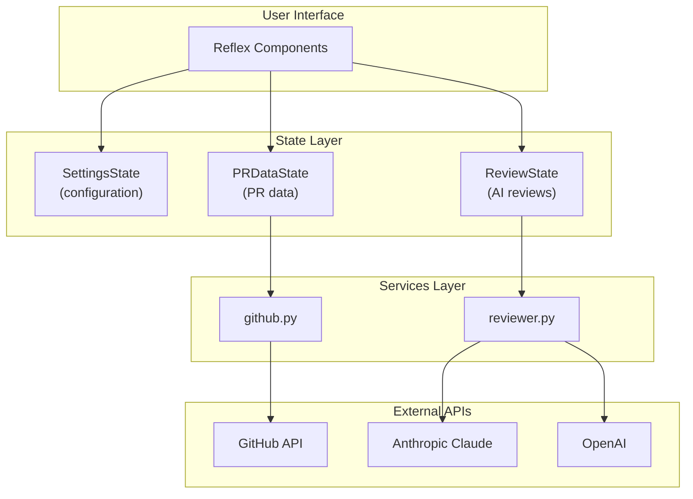
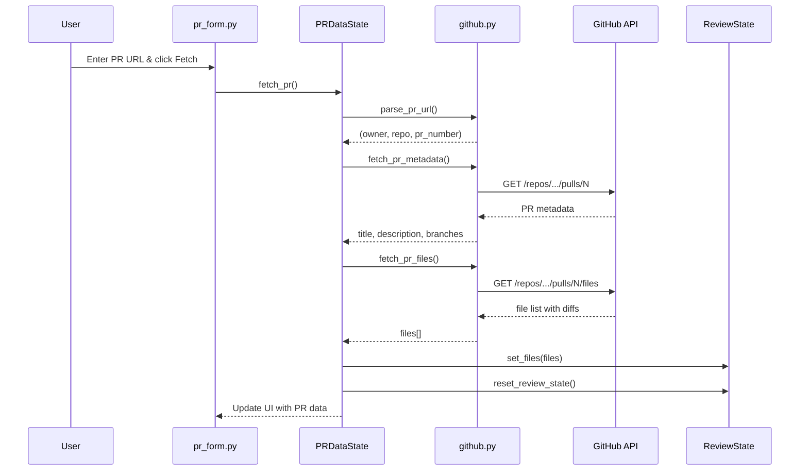
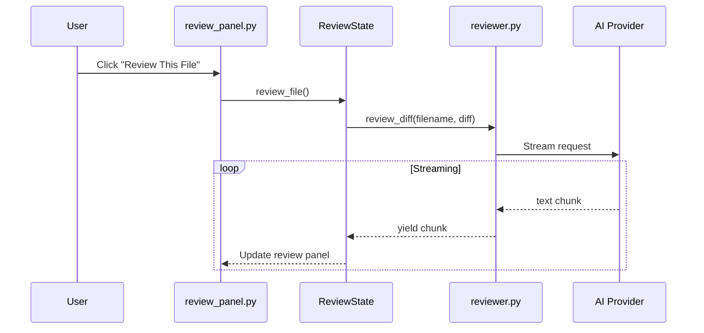
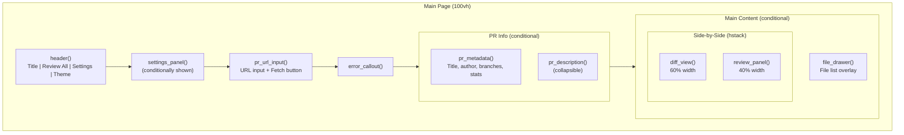

# PR Reviewer Architecture

A local-first GitHub PR code review tool built with [Reflex](https://reflex.dev).

## Overview

PR Reviewer enables users to:

- Paste a GitHub PR URL and fetch the diff
- Get AI-powered code reviews streamed file-by-file
- Choose between AI providers (Anthropic Claude or OpenAI)
- Navigate and review files interactively

## Project Structure

```
pr_reviewer/
├── __init__.py              # Package exports
├── pr_reviewer.py           # Main app entry point & page layout
├── constants.py             # Enums, providers, model definitions
├── components/              # UI components (8 files)
│   ├── header.py            # Title, Review All button, Settings
│   ├── settings.py          # Settings panel (token, provider, model)
│   ├── pr_form.py           # PR URL input & error display
│   ├── pr_metadata.py       # PR info (title, author, description)
│   ├── file_drawer.py       # File list drawer (left sidebar)
│   ├── diff_view.py         # Diff viewer with syntax highlighting
│   └── review_panel.py      # AI review panel & review button
├── state/                   # State management (3 substates)
│   ├── settings.py          # SettingsState
│   ├── pr_data.py           # PRDataState
│   └── review.py            # ReviewState
└── services/                # Business logic
    ├── github.py            # GitHub API integration
    └── reviewer.py          # AI provider integration
```

## High-Level Architecture



## Data Flow

### Fetching a PR



### Reviewing a File



## Page Layout



## Key Design Decisions

### Reflex Substates

The app uses **3 separate Reflex State classes** rather than a single monolithic state:

| State           | Responsibility                               |
| --------------- | -------------------------------------------- |
| `SettingsState` | User configuration (tokens, provider, model) |
| `PRDataState`   | PR fetching, metadata, file selection        |
| `ReviewState`   | AI reviews, streaming, progress tracking     |

This separation provides:

- Clear boundaries between concerns
- Independent state updates
- Easier testing and debugging

### State Synchronization

ReviewState needs access to files and selected file for computed vars. Since `@rx.var` can't use async `get_state()`, files are explicitly synced:

```python
# In PRDataState.fetch_pr()
review_state = await self.get_state(ReviewState)
review_state.set_files(files)
```

### Async Generators for Streaming

State methods that stream data use async generators:

```python
async def review_file(self) -> AsyncGenerator[None, None]:
    async for chunk in review_diff(...):
        self._set_file_review(filename, accumulated)
        yield  # Let UI update
```

## Environment Configuration

```
ANTHROPIC_API_KEY=sk-ant-xxx    # Required for Anthropic
OPENAI_API_KEY=sk-xxx           # Required for OpenAI
GITHUB_TOKEN=ghp_xxx            # Optional (increases rate limit 60→5000/hr)
```

## Related Documentation

- [State Management](./state-management.md) - Deep dive into substates
- [Components](./components.md) - UI component details
- [Services](./services.md) - GitHub and AI integration
