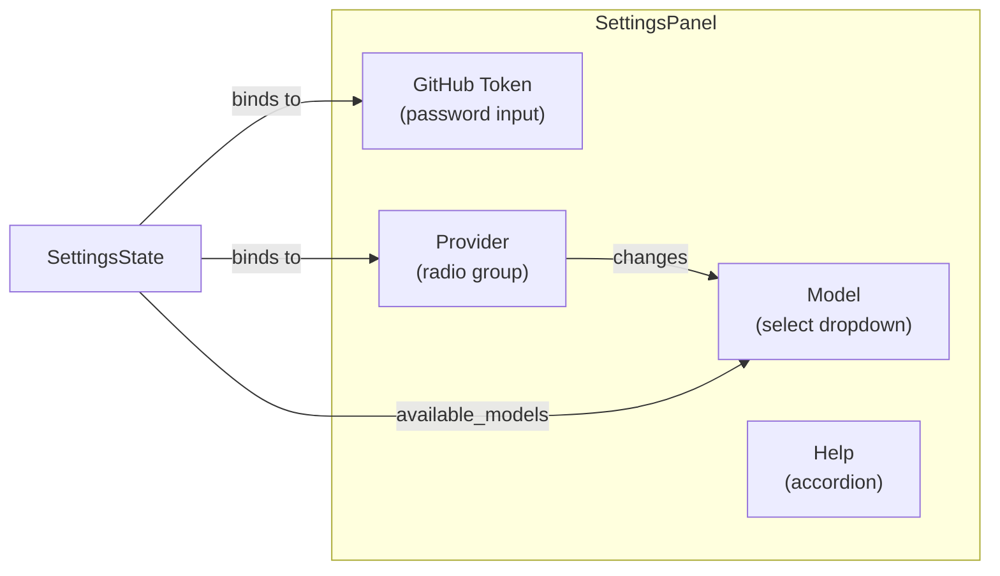

# Components

UI components are organized by feature in `pr_reviewer/components/`. Each file exports factory functions that return `rx.Component` objects.

## Component Hierarchy

```mermaid
flowchart TB
    subgraph Page["index() - pr_reviewer.py"]
        header["header()"]
        settings["settings_panel()"]
        form["pr_url_input()"]
        error["error_callout()"]
        meta["pr_metadata()"]
        content["main_content()"]
    end

    subgraph Header["header.py"]
        h1["Title + Subtitle"]
        rab["review_all_button()"]
        sb["settings_button()"]
        theme["Theme toggle"]
    end

    subgraph Settings["settings.py"]
        token["GitHub token input"]
        provider["Provider selector"]
        model["Model selector"]
        help["Help accordion"]
    end

    subgraph PRMeta["pr_metadata.py"]
        title["PR title + author"]
        desc["pr_description()"]
        trigger["file_drawer_trigger()"]
        warn["truncation_warning()"]
    end

    subgraph MainContent["main_content()"]
        drawer["file_drawer()"]
        diff["diff_view()"]
        review["review_panel()"]
    end

    header --> h1
    header --> rab
    header --> sb
    settings --> token
    settings --> provider
    settings --> model
    meta --> title
    meta --> desc
    meta --> trigger
    content --> drawer
    content --> diff
    content --> review
```



## header.py

Main header with title, actions, and settings.

### `header()`

Top-level header component with:

- Title ("PR Reviewer") and subtitle
- Review All button (right side)
- Settings button (gear icon)
- Theme toggle button

### `review_all_button()`

Contextual button showing different states:

| State        | Appearance                           |
| ------------ | ------------------------------------ |
| Reviewing    | Disabled, shows "Reviewing... (3/7)" |
| All reviewed | Success badge "All 7 files reviewed" |
| Ready        | "Review All Files" button            |

### `settings_button()`

Gear icon button that toggles `SettingsState.settings_open`.

## settings.py

Collapsible settings panel for configuration.

### `settings_panel()`

Card containing:

- **GitHub Token Input** - Password field for PAT
- **Provider Selector** - Radio group (Anthropic / OpenAI)
- **Model Selector** - Dropdown based on selected provider
- **Help Accordion** - Instructions for generating GitHub token



## pr_form.py

PR URL input form.

### `pr_url_input()`

Form with:

- Text input for GitHub PR URL
- "Fetch PR" button
- Loading state handling

### `error_callout()`

Red alert box showing `PRDataState.error_message`. Conditionally rendered when error exists.

## pr_metadata.py

PR information display after successful fetch.

### `pr_metadata()`

Container for:

- `truncation_warning()` - Alert if >100 files
- PR title with link
- Author badge
- Branch info (head → base)
- `pr_description()` - Collapsible description
- `file_drawer_trigger()` - Button to open file list

### `pr_description()`

Collapsible section showing PR description. Uses `PRDataState.description_expanded` for visibility.

### `truncation_warning()`

Yellow alert shown when `PRDataState.files_truncated` is true, warning that only first 100 files are shown.

## file_drawer.py

Slide-out drawer for file navigation.

### `file_drawer()`

Left-side overlay drawer containing:

- Header with file count
- Scrollable list of `file_list_item()` components

### `file_list_item(file)`

Individual file row with:

- `file_status_indicator()` - Status icon
- Filename (highlighted if selected)
- Addition/deletion stats (+X / -Y)
- Click handler to select file

### `file_status_indicator(status)`

Icon based on file status:

| Status   | Icon | Color  |
| -------- | ---- | ------ |
| added    | `+`  | Green  |
| removed  | `-`  | Red    |
| renamed  | `R`  | Yellow |
| modified | `M`  | Blue   |

### `file_drawer_trigger()`

Button showing file count badge that opens the drawer.

## diff_view.py

Syntax-highlighted diff viewer.

### `diff_view()`

Container for:

- `diff_header()` - Filename and stats
- `diff_content()` - The actual diff

### `diff_header()`

Shows:

- Filename
- Status badge (Added, Modified, etc.)
- Line stats (+X / -Y)

### `diff_content()`

Renders the diff patch with:

- Line numbers
- Syntax highlighting for additions/deletions
- Monospace font styling

## review_panel.py

AI review display panel.

### `review_panel()`

Right-side panel containing:

- `review_button()` - Trigger review
- `review_error_display()` - Error messages
- `review_content()` - The review text

### `review_button()`

Contextual button:

| State      | Appearance                      |
| ---------- | ------------------------------- |
| Reviewing  | Disabled spinner "Reviewing..." |
| Has review | Success "Reviewed" badge        |
| Ready      | "Review This File" button       |

### `review_content()`

Markdown renderer for `ReviewState.selected_file_review`. Shows:

- Loading skeleton during streaming
- Formatted markdown when complete
- Empty state when no review

### `review_error_display()`

Red callout showing `ReviewState.review_error` when present.

## Component Patterns

### Conditional Rendering

```python
rx.cond(
    PRDataState.has_pr_loaded,
    pr_metadata(),  # Shown when PR loaded
    rx.fragment()   # Empty otherwise
)
```

### Status-Based Styling

```python
rx.match(
    file["status"],
    ("added", rx.badge("Added", color="green")),
    ("removed", rx.badge("Removed", color="red")),
    rx.badge("Modified", color="blue")  # Default
)
```

### List Rendering

```python
rx.foreach(
    PRDataState.files,
    lambda file: file_list_item(file)
)
```

### Event Binding

```python
rx.button(
    "Fetch PR",
    on_click=PRDataState.fetch_pr,
    loading=PRDataState.is_loading
)
```

### Two-Way Input Binding

```python
rx.input(
    value=PRDataState.pr_url,
    on_change=PRDataState.set_pr_url,
    placeholder="https://github.com/owner/repo/pull/123"
)
```
