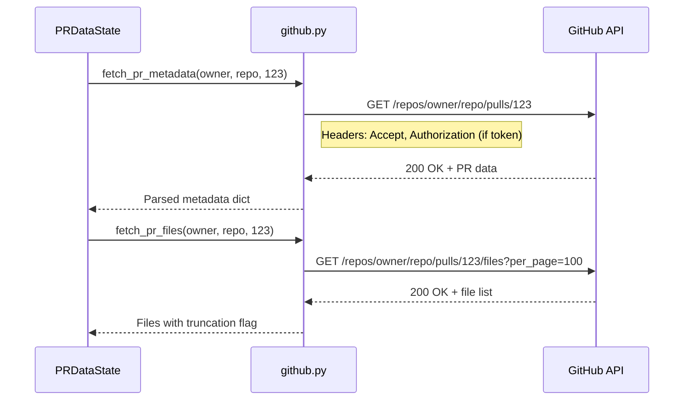
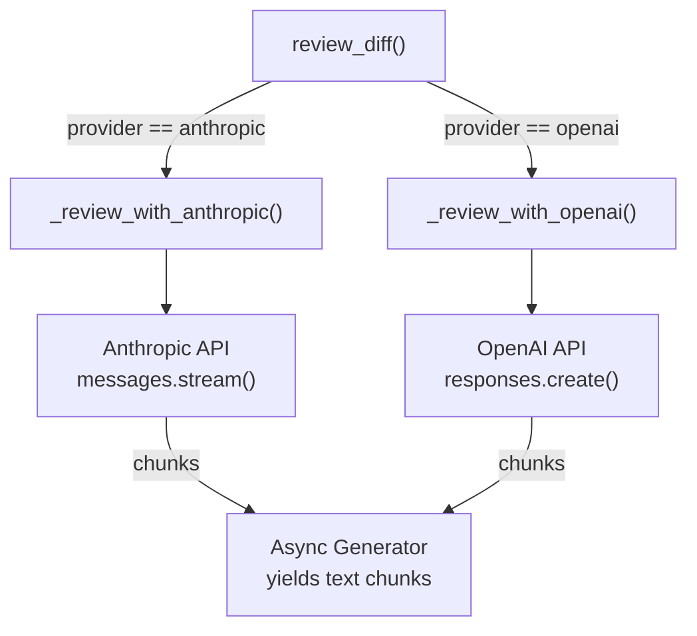
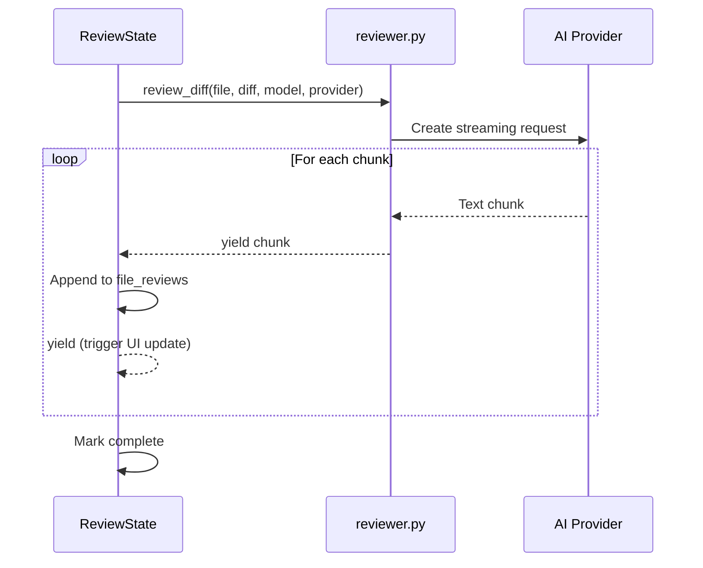

# Services

Business logic is separated into service modules in `pr_reviewer/services/`.

## GitHub Integration

**Location:** `services/github.py`

Handles all GitHub API communication.

### Functions

#### `parse_pr_url(url: str) -> tuple[str, str, int] | None`

Parses GitHub PR URLs into components.

**Supported formats:**

- `https://github.com/owner/repo/pull/123`
- `https://www.github.com/owner/repo/pull/123`

**Returns:** `(owner, repo, pr_number)` or `None` if invalid

#### `fetch_pr_metadata(owner, repo, pr_number, token=None) -> dict`

Fetches PR information from GitHub API.

**Returns:**

```python
{
    "title": "Add feature X",
    "description": "This PR adds...",
    "author": "username",
    "base_branch": "main",
    "head_branch": "feature-x",
    "additions": 150,
    "deletions": 30
}
```

**Errors:**

- `ValueError` with message for 404 (not found) or 403 (rate limit)
- Raises `httpx.HTTPStatusError` for other failures

#### `fetch_pr_files(owner, repo, pr_number, token=None, max_files=100) -> dict`

Fetches changed files with diffs.

**Returns:**

```python
{
    "files": [
        {
            "filename": "src/app.py",
            "status": "modified",
            "additions": 10,
            "deletions": 3,
            "patch": "@@ -1,5 +1,7 @@\n..."
        }
    ],
    "total_count": 150,
    "truncated": True  # If more than max_files
}
```

### API Flow



### Authentication

GitHub token is optional but recommended:

- **Without token:** 60 requests/hour
- **With token:** 5,000 requests/hour

Token is passed via `Authorization: Bearer {token}` header.

### Error Handling

| Status | Error                                                             |
| ------ | ----------------------------------------------------------------- |
| 404    | "PR not found. Check the URL or the repository might be private." |
| 403    | "GitHub API rate limit exceeded. Add a GitHub token in settings." |
| Other  | Raises `httpx.HTTPStatusError`                                    |

## AI Review Integration

**Location:** `services/reviewer.py`

Handles AI-powered code review with multiple provider support.

### Functions

#### `review_diff(filename, diff, model, provider, api_key=None) -> AsyncGenerator[str, None]`

Streams an AI code review for a file's diff.

**Parameters:**

- `filename` - Name of the file being reviewed
- `diff` - The unified diff patch content
- `model` - Model ID (e.g., "claude-sonnet-4-5-20250929")
- `provider` - "anthropic" or "openai"
- `api_key` - Optional override (defaults to env var)

**Yields:** Text chunks as they stream from the API

### Provider Architecture



### System Prompt

Both providers use the same system prompt:

```
You are a code reviewer. Analyze the following diff and provide a concise review.

Focus on:
- Potential bugs or logic errors
- Security vulnerabilities
- Performance issues
- Code clarity and maintainability
- Missing error handling

Format your response as:
## Summary
[1-2 sentence overview]

## Issues
[List specific issues found, or "None found" if the code looks good]

## Suggestions
[Optional improvements, if any]
```

### Anthropic Implementation

```python
async def _review_with_anthropic(user_message, model, api_key):
    client = anthropic.AsyncAnthropic(api_key=api_key)
    async with client.messages.stream(
        model=model,
        max_tokens=1024,
        system=SYSTEM_PROMPT,
        messages=[{"role": "user", "content": user_message}]
    ) as stream:
        async for text in stream.text_stream:
            yield text
```

**API Key:** `ANTHROPIC_API_KEY` env var or passed explicitly

### OpenAI Implementation

```python
async def _review_with_openai(user_message, model, api_key):
    client = openai.AsyncOpenAI(api_key=api_key)
    response = await client.responses.create(
        model=model,
        instructions=SYSTEM_PROMPT,  # Note: uses instructions field
        input=user_message,
        stream=True
    )
    async for event in response:
        if hasattr(event, "delta"):
            yield event.delta
```

**API Key:** `OPENAI_API_KEY` env var or passed explicitly

### Streaming Flow



## Model Configuration

**Location:** `constants.py`

### Anthropic Models

```python
ANTHROPIC_MODELS = {
    "opus": ("claude-opus-4-5-20251101", "Claude Opus 4.5"),
    "sonnet": ("claude-sonnet-4-5-20250929", "Claude Sonnet 4.5"),
    "haiku": ("claude-haiku-4-5-20251001", "Claude Haiku 4.5"),
}
```

### OpenAI Models

```python
OPENAI_MODELS = {
    "gpt-5.2": ("gpt-5.2", "GPT-5.2"),
    "codex": ("gpt-5.1-codex", "GPT-5.1 Codex"),
    "codex-mini": ("gpt-5.1-codex-mini", "GPT-5.1 Codex Mini"),
    "gpt-4o": ("gpt-4o", "GPT-4o"),
}
```

### Defaults

```python
DEFAULT_PROVIDER = Provider.ANTHROPIC
DEFAULT_MODEL = ANTHROPIC_MODELS["sonnet"][0]  # claude-sonnet-4-5-20250929
```

## Error Handling

### GitHub Errors

Errors are raised as `ValueError` with user-friendly messages:

- Rate limiting suggests adding a token
- 404 suggests checking URL or private repo access

### AI Provider Errors

Provider-specific exceptions are caught in ReviewState:

- `anthropic.APIError`
- `openai.APIError`

Errors are stored in `ReviewState.review_error` for display.

### Empty Diffs

Files without patches (e.g., binary files) are skipped during batch review:

```python
if not diff:
    continue  # Skip files without diff content
```
