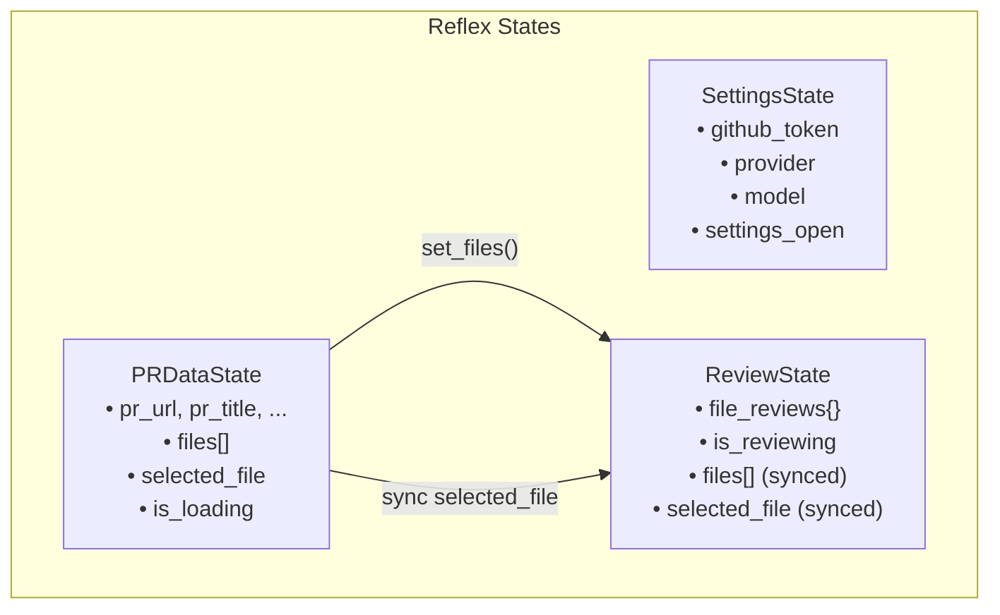
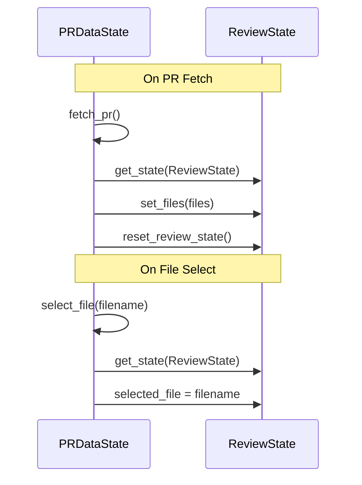

# State Management

PR Reviewer uses Reflex's state management with **3 separate substates** for clear separation of concerns.

## State Hierarchy



## SettingsState

**Location:** `state/settings.py`

Manages user configuration that persists across PR fetches.

### State Variables

| Variable        | Type   | Description                           |
| --------------- | ------ | ------------------------------------- |
| `github_token`  | `str`  | GitHub personal access token          |
| `provider`      | `str`  | AI provider ("anthropic" or "openai") |
| `model`         | `str`  | Selected model ID                     |
| `settings_open` | `bool` | Settings panel visibility             |

### Key Methods

```python
def toggle_settings(self)         # Toggle panel visibility
def set_provider(self, value)     # Switch provider, reset model to default
def set_model(self, value)        # Set model by ID
def set_github_token(self, value) # Store GitHub token
```

### Computed Vars

```python
@rx.var
def has_github_token(self) -> bool
    # True if token is set

@rx.var
def provider_display_name(self) -> str
    # "Anthropic" or "OpenAI"

@rx.var
def available_models(self) -> list[dict]
    # Models for current provider: [{id, display_name}, ...]

@rx.var
def model_display_name(self) -> str
    # Human-readable model name
```

## PRDataState

**Location:** `state/pr_data.py`

Handles PR fetching, metadata storage, and file selection.

### State Variables

| Variable               | Type         | Description                |
| ---------------------- | ------------ | -------------------------- |
| `pr_url`               | `str`        | PR URL from user input     |
| `pr_title`             | `str`        | PR title from GitHub       |
| `pr_author`            | `str`        | PR author username         |
| `pr_description`       | `str`        | PR description/body        |
| `pr_base_branch`       | `str`        | Target branch              |
| `pr_head_branch`       | `str`        | Source branch              |
| `total_additions`      | `int`        | Lines added                |
| `total_deletions`      | `int`        | Lines removed              |
| `files`                | `list[dict]` | Changed files with diffs   |
| `files_truncated`      | `bool`       | True if >100 files         |
| `selected_file`        | `str`        | Currently viewing filename |
| `is_loading`           | `bool`       | Fetch in progress          |
| `error_message`        | `str`        | User-facing error          |
| `file_drawer_open`     | `bool`       | Drawer visibility          |
| `description_expanded` | `bool`       | Description visibility     |

### File Object Structure

```python
{
    "filename": "src/app.py",
    "status": "modified",      # added, removed, renamed, modified
    "additions": 10,
    "deletions": 3,
    "patch": "@@ -1,5 +1,7 @@\n ...",  # Unified diff
    "previous_filename": "..."  # Only if renamed
}
```

### Key Methods

#### `fetch_pr()` - Async Generator

```python
async def fetch_pr(self) -> AsyncGenerator[None, None]:
    # 1. Validate URL and parse components
    # 2. Fetch PR metadata from GitHub
    # 3. Fetch PR files with diffs
    # 4. Store all data in state
    # 5. Sync files to ReviewState
    # 6. Reset ReviewState
```

**Important:** This is an async generator that yields to allow UI updates during the fetch process.

#### `select_file(filename)`

```python
async def select_file(self, filename: str):
    # 1. Update selected_file
    # 2. Open file drawer if closed
    # 3. Sync to ReviewState.selected_file
```

### Computed Vars

```python
@rx.var
def has_pr_loaded(self) -> bool
    # True if PR was fetched

@rx.var
def file_count(self) -> int
    # Number of changed files

@rx.var
def selected_file_data(self) -> dict | None
    # Full file object for selected file

@rx.var
def selected_file_diff(self) -> str
    # Patch content for diff view

@rx.var
def selected_file_additions(self) -> int
def selected_file_deletions(self) -> int
    # Stats for selected file
```

## ReviewState

**Location:** `state/review.py`

Manages AI code reviews and streaming.

### State Variables

| Variable                   | Type             | Description                    |
| -------------------------- | ---------------- | ------------------------------ |
| `file_reviews`             | `dict[str, str]` | Filename → review text         |
| `current_review_file`      | `str`            | File being reviewed            |
| `is_reviewing`             | `bool`           | Single file review in progress |
| `is_reviewing_all`         | `bool`           | Batch review in progress       |
| `review_all_current_index` | `int`            | Progress in batch (1-indexed)  |
| `review_error`             | `str`            | Error message                  |
| `files`                    | `list[dict]`     | **Synced from PRDataState**    |
| `selected_file`            | `str`            | **Synced from PRDataState**    |

### Key Methods

#### `review_file()` - Async Generator

```python
async def review_file(self) -> AsyncGenerator[None, None]:
    # 1. Get selected file's diff
    # 2. Stream review from AI provider
    # 3. Update file_reviews progressively
```

#### `review_all_files()` - Async Generator

```python
async def review_all_files(self) -> AsyncGenerator[None, None]:
    # For each file with a diff:
    #   1. Skip if already reviewed
    #   2. Update progress indicators
    #   3. Stream review
    #   4. Yield for UI updates
```

#### Helper Methods

```python
def set_files(self, files: list[dict])
    # Sync files from PRDataState

def reset_review_state(self)
    # Clear reviews on new PR fetch

def _set_file_review(self, filename: str, review: str)
    # Update single file review (internal)

def _update_file_review(self, filename: str, chunk: str) -> str
    # Append chunk, return accumulated text
```

### Computed Vars

```python
@rx.var
def selected_file_review(self) -> str
    # Review text for current file

@rx.var
def has_selected_file_review(self) -> bool
    # True if current file has review

@rx.var
def reviewable_files(self) -> list[dict]
    # Files with diffs (can be reviewed)

@rx.var
def reviewable_file_count(self) -> int
    # Count of reviewable files

@rx.var
def reviewed_file_count(self) -> int
    # Count of completed reviews

@rx.var
def review_progress_text(self) -> str
    # "3/7" format for batch progress

@rx.var
def all_files_reviewed(self) -> bool
    # True when batch complete
```

## State Synchronization Pattern



### Why Sync is Needed

Reflex computed vars (`@rx.var`) cannot use `await get_state()`. ReviewState's computed vars need access to:

- `files` - to compute `reviewable_files`, `reviewable_file_count`
- `selected_file` - to compute `selected_file_review`, `has_selected_file_review`

By syncing these values, ReviewState can compute everything locally.

## Race Condition Protection

Both PRDataState and ReviewState prevent concurrent operations:

```python
# PRDataState.fetch_pr()
if self.is_loading:
    return
self.is_loading = True

# ReviewState.review_file()
if self.is_reviewing or self.is_reviewing_all:
    return
self.is_reviewing = True
```

## Async Generator Pattern

State methods that stream data use async generators for progressive UI updates:

```python
async def review_file(self) -> AsyncGenerator[None, None]:
    accumulated = ""
    async for chunk in review_diff(...):
        accumulated += chunk
        self._set_file_review(filename, accumulated)
        yield  # Critical: lets Reflex update the UI
```

The `yield` statement triggers a state update, causing bound components to re-render with the new data.
